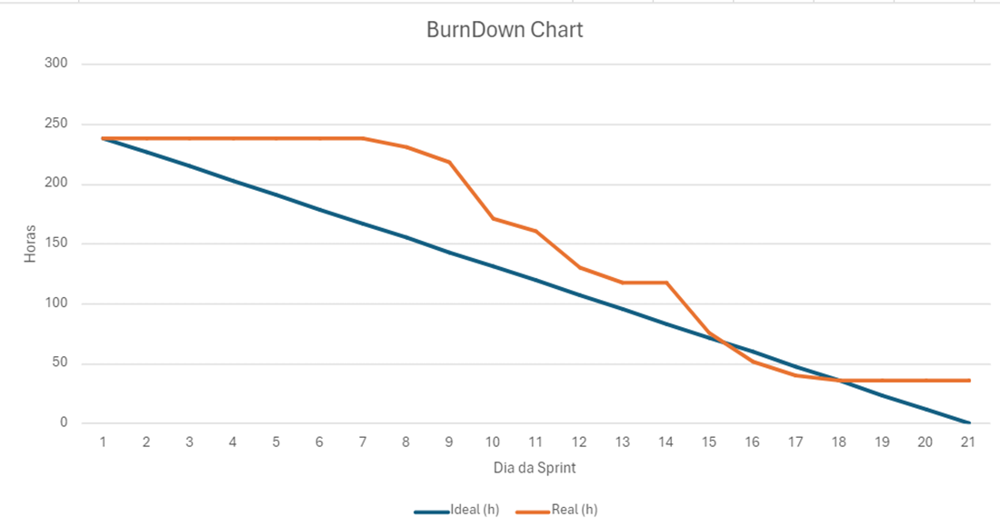

# Sprint - 1️⃣ 

- [x] **Cadastro de dados dos sensores via arquivo CSV**

*Contexto:*

> Atualmente, os dados coletados coletados pelos sensores da estufa estão armazenados em um arquivo do tipo [CSV](https://www.freecodecamp.org/portuguese/news/o-que-e-um-arquivo-csv-e-como-abrir-esse-formato-de-arquivo/).

*História de usuário:*

> Como mantenedor da estufa, quero fazer o upload de dados contidos nos meu arquivo CSV no sistema para armazená-los de forma mais segura.

*Critérios de aceitação:*

- O upload deve aceitar arquivos CSV tanto em formato de texto, quanto de Excel.
- O sistema deve validar os dados contidos no arquivo antes de concluir o upload, ou seja, deve haver conformidade com as colunas presentes nos arquivos CSV do cliente, assim como o tipo de dado registrado.

---

- [x] **Geração de gráficos dos dados de sensores**

*Contexto:*

> Atualmente, eu gero um gráfico no excel a partir dos arquivo CSV referente aos dados coletados pelos sensores.

*História de usuário:*

> Como mantenedor da estufa, quero que o sistema geres um gráfico para cada dado de um registro coletado pelos sensores com relação a um período de dias a fim de facilitar minha análise acerca do andamento da estufa ao longo do tempo.

*Critérios de aceitação:*

- Deve ser exibido um gráfico de linha para cada um desses valores:
  - Umidade do solo X Dias.
  - Umidade do ambiente X Dias.
  - Temperatura X Dias.
  - Volume de água  X Dias.
- Cada gráfico deve possuir título.
- O eixo vertical de cada gráfico deve corresponder a escala de cada dado.
- Os gráficos de linha devem ser de cores diferentes.

---

- [x] **Filtragem de dados dos gráficos de sensores ao longo do tempo.**

*História de usuário:*

> Como mantenedor da estufa, quero poder filtrar os dados dos sensores exibidos pelos gráficos para determinados períodos de dias a fim de que eu possa acompanhar a evolução desses valores em diferentes faixas de tempo.

*Critérios de aceitação:*

- Cada valor no gráfico deve corresponder a média registrada por dia.
- O usuário deve poder selecionar um período de dias para fazer a filtragem, sendo:
  - 7 dias.
  - 30 dias.
  - 90 dias.
- O padrão deve ser o período que corresponde a 7 dias.

---

- [x] **Cálculo de média dos dados coletados pelos sensores.**

*História de usuário:*

> Como mantenedor da estufa, quero que o sistema calcule a média de cada dado coletado pelo sensores ao longo do tempo para que eu possa identificar padrões ou realizar previsões a respeito desses valores.

*Critérios de aceitação:*

- O cálculo deve ser realizado utilizando cada gráfico de linha dos dados coletados pelos sensores.
- O cálculo deve corresponder ao período de dias selecionado pelo usuário.
- O cálculo deve ser refeito assim que o usuário altera o período de dias selecionado.

---

- [x] **Exibição do último registro coletado pelos sensores**

*História de usuário:*

> Como mantenedor da estufa, quero poder ver o último registro coletado pelos sensores para que eu tenha noção do estado atual da estufa.

*Critérios de aceitação:*

- Os dados do último registro coletado pelos sensores deve ser exibida na página principal do site.
- Cada dado do registro deve ter seu destaque próprio na página.
- Deve ser exibido a data e horário em que o registro foi coletado.

## Burndown chart 📈

## Slides for presentation 🎞️

**<a href="../ppt/sprint-1.pptx" _target="black" download="sprint-1-apresentacao">Click to download the ppt</a>**
