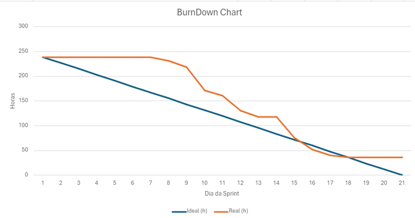

# Sprint - 2️⃣

- [x] **Cadastro de dados de check-list via arquivo CSV**

*Contexto:*

> Atualmente, eu tenho os dados de check-list contidos em um arquivo CSV.

*História de usuário:*

> Como mantenedor da estufa, quero fazer o upload de dados de check-list contidos em um arquivo CSV no sistema para armazená-los de forma mais segura.

*Critérios de aceitação:*

- O upload dos dados de check-list deve serguir o mesmo procedimento do upload dos dados coletado pelos sensores.  

---

- [x] **Geração de gráficos acerca dados de check-list**

*Contexto:*

> Atualmente, eu gero vários gráficos no excel a partir do arquivo CSV referente aos dados de check-list.

*História de usuário:*

> Como mantenedor da estufa, quero que o sistema gere gráficos referente os dados de check-list com relação a um período de dias a fim de facilitar minha comparação com os dados coletados pelos sensores.

*Critérios de aceitação:*

- Deve haver 3 gráficos:
  - PH do solo x Dias.
  - Coloração das Plantas x Dias.
  - Estado das folhas x Dias.
- Os três gráficos deve ser do tipo pizza.

---

- [x] **Cadastro de dados de check-list via formulário**

*Contexto:*

> Atualmente, eu insiro em um Form's dados de check-list a fim de fazer a comparação com os dados coletados pelos sensores.

*História de usuário:*

> Como mantenedor da estufa, quero poder fazer o cadastro de dados de check-list via formulário para mantê-los salvo dentro do sistema.

*Critérios de aceitação:*

- O formulário deve conter os seguintes campos:
  - Qual plantio foi realizado para coletar os dados? (INTERNO OU EXTERNO).
  - Data da coleta (dd/mm/yyyy).
  - Hora da coleta (valor numérico entre 0 a 23).
  - Umidade do solo (%).
  - PH do solo (%).
  - Data de validade da adubação (dd/mm/yyyy).
  - Consumo de água (mililítro).
  - Temperatura ambiente (ºC).
  - Umidade do ar (%).
  - IAF - Índice da área Foliar (%).
  - Qual aspecto das folhas? (SAUDÁVEL OU MURCHA).
  - Qual a coloração das folhas? (VERDE ou VERDE CLARO).
  - Algum desvio detectado durante o processo? (Texto corrido).
- Apenas os campos "IAF" e "Algum desvio detectado durante o processo?" podem ser nulos.

---

- [x] **Tabela de exibição de registros**

*História de usuário:*

> Como mantenedor da estufa, quero visualizar os registros tanto referente aos dados coletados pelos sensores quanto ao check-list em respectivas tabelas a fim de que eu possa visualizar esses dados de forma escrita.

*Critérios de aceitação:*

- Cada linha da tabela deve exibir um registro contendo seus respectivos dados para cada coluna presente no arquivo CSV.
- Os registros deve ser ordenados por ordem descrescente com relação à data de cadastro.

---

- [x] **Cadastro de planta**

*História de usuário:*

> Como administrador, quero poder cadastrar uma planta para que eu possa associá-la a um registro de checklist ou um registro coletado pelos sensores.

*Critérios de aceitação:*

- O cadastro deve ocorrer via formulário contendo os campos:
  - Nome da planta
  - Cor para indentificá-la dentro do sistema

---

- [x] **Edição de planta**

*História de usuário:*

> Como administrador, quero poder editar o nome de uma planta para que eu corrija enventuais erros de digitação

*Critérios de aceitação:*

- O fomulário de cadastro deve ser reutilizado para fazer a edição.

---

- [x] **Listagem de plantas**

*História de usuário:*

> Como mantenedor da estufa, quero poder ver todas as plantas cadastrados no sistema.

*Critérios de aceitação:*

- Cada planta de ser mostrado em forma de card, exibindo nome e cor que a identifica no sistema. 

---

- [x] **Cadastro de dados dos sensores via formulário**

*História de usuário:*

> Como mantenedor da estufa, quero poder fazer o cadastro de dados coletos pelos sensores no sistema por meio de um formulário, com o objetivo de fazer o cadastramento de uma forma mais manual caso eu queira.

*Critérios de aceitação:*

- O formulário deve conter os seguintes campos:
  - Data (dd/mm/aaaa).
  - Horário (Horas:Minutos).
  - Umidade do solo (%).
  - Umidade Ambiente (%).
  - Temperatura Ambiente (°C).
  - Volume de água (ml).
- O sistema deve validar os dados vindo do formulário, ou seja, se os campos estão condizentes com os dados armazenados no arquivo CSV.
- Nenhum campo pode ser nulo.

---

- [x] **Edição de registros**

*História de usuário:*

> Como administrador, quero pode editar qualquer campo de qualquer registro referente aos dados coletados pelos sensores para que eu possa corregir eventuais erros de cadastro.*

*Critérios de aceitação:*

- O usuário deve poder editar por meio de formulário que conterá por padrão todos os dados atuais daquele registro.
- Os sistema deve validar os novos dados cadastrado.

- [x] **Deleção de registros**

*História de usuário:*

> Como administrador, quero pode deletar qualquer registro referente aos dados coletados pelos sensores para poder remover os repetidos ou os incongruentes.*

*Critérios de aceitação:*

- O usuário deve poder selecionar um ou mais registros para deletar.

- [x] **Paginação de registros**

*História de usuário:*

> Como administrador, quero que as tabelas possuem páginas onde cada página tenha no máximo 20 registros para que nem todos os registros cadastrados nos sistema seja exibidos.

*Critérios de aceitação:*

- Deverá haver uma navegação composta por botões embaixo de cada tabela para que o usuário possa nagevar entre as páginas.
- Deve haver um indicativo de qual página o usuário está.
- A nevegação deve exibir no máximo 5 botões, ou seja, a numeração dos botões deve ser dinâmica com base na quantidade.

## Gráfico Burndown 📈

## Slides para apresentação 🎞️

**<a href="../ppt/sprint-2-presentation.pptx" _target="black" download="sprint-1-apresentacao">Clique para baixar o ppt</a>**