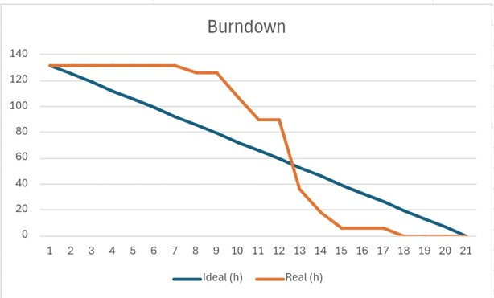

# Sprint - 3️⃣

- [x] **Cadastro automatizado dos dados coletados pelos sensores**

*Contexto:*

> Atualmente, os dados coletados pelos sensores da estufa são inseridos em um cartão microSD de forma automática por meio de uma placa (microcontrolador) Wemos D1 R32.

*História de usuário:*

> Como mantenedor da estufa, quero que o sistema consiga receber os dados inseridos no cartão microSD de forma automatizada para que eu não tenha que ficar retirando o cartão microSD para fazer o registro dos dados contidos nele.

*Critérios de aceitação:*

- Os dados devem ser cadastrados no sistema assim que o cartão SD receber dados dos sensores da estufa.
- Os dados enviados pelo microcontrolador devem ser validados no sistema.
- Os sistema deve abortar a comunicação caso algum dado não esteja no formato correto.

---

- [x] **Filtragem de registros**

*História de usuário:*

> Como mantenedor da estufa, quero pode filtrar registros exibidos nas tabelas por período compreendido entre duas datas.

*Critérios de aceitação:*

- O usuário deve selecionar uma data de início e uma data de fim (as duas datas são inclusas no filtro).
- Apenas os registros compreendidos entre essas duas datas devem ser exibidos nas suas respectivas tabelas.

---

- [x] **Mensagens de alerta**

*História de usuário:*

> Como mantenedor da estufa, quero poder se avisado que estou fazendo uma ação que pode afetar o sistema como um todo para eu não cometer equívicos e ter certeza do que eu estou fazendo.

> Critérios de aceitação

- O usuário deve ser avisado por mensagem de texto ao tentar editar ou deletar qualquer registro do sistema (seja referente aos dados dos sensores ou do check-list).
- O usuário deve poder confirmar ou cancelar a ação por botões presentes abaixo da mensagem.

---

- [x] **Mensagens de erro**

*História de usuário:*

> Como mantenedor da estufa, quero que o sistema exiba mensagens quando alguma ação minha não for realizada com sucesso para que eu tenha consciência de fato que algo ocorreu de errado.

*Critérios de aceitação:*

- O sistema deve exibir mensagens de error referente à má formatação dos dados inseridos pelo usuário nos formulários em cada campo má formatado, assim como exibir uma mensagem de erro na página caso o erro não esteja relacionado a um campo de formulário mas a algum erro interno do sistema.
- As mensagens devem estar bem destacadas do resto dos elementos da página.

## Gráfico Burndown 📈

## Slides para apresentação 🎞️

**<a href="../ppt/sprint-3-presentation.pptx" _target="black" download="sprint-3-apresentacao">Clique para baixar o ppt</a>**
